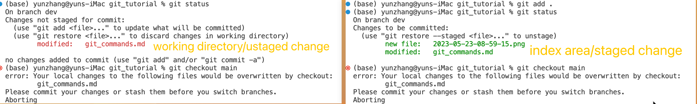

# Repo

## Edit in local repo

## ADD change from remote repo
## Edit in local repo and push
## add change in local repo #2
## add change from remote again to create conflicts

## add change only in remote #3
## add change only in local #3